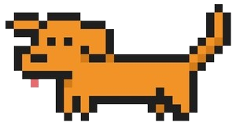

# claude-pets

**A desktop pet for your AI coding sessions.**

A tiny companion that sits on your screen, handles permissions, and lets you talk back.

> **Requires macOS.** Linux/Windows aren't supported yet — PRs welcome.

<p align="center">
  
</p>

---

## What it does

Run `claude-pets` and three things happen:

1. An **Electron daemon** launches and floats a tiny transparent window on your screen
2. A real **Claude Code session** starts in your terminal, wired to the pet via [Claude Code hooks](https://docs.anthropic.com/en/docs/claude-code/hooks)
3. Everything Claude does — thinking, tool calls, messages — shows up in the pet's **speech bubble**

Permission prompts (file edits, bash commands, etc.) get routed to the pet as clickable approve/deny buttons. You can reply from the pet's text box _or_ from the terminal — both feed into the same session.

When Claude is idle, your pet is idle. When Claude is thinking, your pet thinks out loud or shows playful status updates. When Claude needs a response, the pet lets you know and tries to get your attention.

Bring your own pet — drop in PNG, JPG, **animated GIF**, WebP, or SVG (up to 5 MB per image) and your pet will wiggle, blink, or do whatever you draw it doing.

## Install

You need **macOS**, **Node.js 18+**, and [**Claude Code**](https://docs.anthropic.com/en/docs/claude-code) installed and authenticated (`claude` in your PATH).

```bash
git clone https://github.com/ernkerr/claude-pets.git
cd claude-pets
npm install
```

Then from any project directory:

```bash
claude-pets
```

The daemon auto-launches on first run and stays alive in the background. Each invocation spawns a new pet window and a connected Claude Code session.

> **Note:** Run `npm install -g .` after cloning to make `claude-pets` available globally.

## Using it

**Drag the pet anywhere on your screen.** By default it stays on top, visible across all workspaces and fullscreen apps — toggle **Stay on top** off in settings if you'd rather it sit behind your active window.

**Click the status pill** (the label under the pet) to open the speech bubble. Claude's messages show up here. Type in the text box at the bottom to reply, or keep using the terminal — both work.

**Approve or deny tool calls** from the pet. When Claude wants to edit a file or run a command, the pet shows exactly what it wants to do with a diff preview. Hit allow, deny, or deny with feedback telling Claude what to do differently. You can also allow a tool for the rest of the session so it stops asking.

**Hit the gear icon** to open settings:

- **Thinking out loud** — shows verbose status updates while Claude works
- **Playful status** — fun phrases instead of literal tool names ("cooking..." instead of "Edit file")
- **Stay on top** — keeps the pet above other windows. Turn it off if it gets in the way of tabs or anything else you're clicking on.

**End the session** from the terminal with `Ctrl+C` or from settings in the pet. Either way, hooks get cleaned up and the window closes.

## Make your own pet

The default is a pixel-art sausage dog. To add your own:

1. Click the **pencil icon** in the speech bubble to open the pet editor
2. Click **Add Pet** and give it a name
3. Upload images for each state — click the boxes or **drag files directly onto them**
4. Click your pet in the gallery to activate it

Every pet has up to three states:

| State              | When                          | Required? |
| ------------------ | ----------------------------- | --------- |
| **Idle**           | Claude is resting             | Yes       |
| **Thinking**       | Claude is working             | No        |
| **Needs response** | Permission prompt or question | No        |

If you skip thinking or needs-response, the pet falls back to idle. GIFs animate — so if you want a pet that wiggles while Claude thinks, go for it.

**Drag between state boxes** to swap images. Double-click a name in the gallery to rename. Hit the **X** to delete.

**Supported formats:** PNG, JPG, GIF, WebP, SVG — max 5 MB per image.

## FAQ

**Does this use `dangerouslySkipPermissions` like other desktop pet agents?**

No. Every tool call goes through the normal Claude Code permission system. The pet is a UI _on top of_ the approval flow — it shows you exactly what Claude wants to do (with diffs for file edits) and waits for you to approve or deny. Nothing runs without your say-so.

**Does this read my repo?**

claude-pets itself doesn't touch your code. It's a UI layer. Claude Code reads your repo the same way it always does — through its normal tool calls, which you approve through the pet.

**Is this free?**

claude-pets is free and open source. You do still need a [Claude Code](https://docs.anthropic.com/en/docs/claude-code) plan since it spawns a real Claude Code session under the hood.

**Can I run multiple pets at once?**

Yes. Each `claude-pets` invocation spawns its own window and session. They cascade from the top-right corner of your screen.

**Where are my pets stored?**

`~/.claude-pets/` — `pets.json` for pet definitions, `images/` for uploaded files.

## How it works

Two processes connected over HTTP on `localhost:47777`:

**The CLI** (`bin/claude-pets.mjs`) spawns Claude Code in a pseudo-terminal via `node-pty`, installs three Claude Code hooks into `.claude/settings.local.json`, and long-polls an inbox for messages typed in the pet's text box. Hooks are automatically cleaned up when the session ends.

**The daemon** (`main.js`) is an Electron app running a local HTTP server. Each session gets its own frameless transparent `BrowserWindow`, a FIFO queue for tool approvals, and an orphan sweeper that detects when the CLI process dies and tears down the session.

**The hooks** wire the two together: `PreToolUse` intercepts tool calls and routes permission prompts to the pet bubble (auto-allowing safe reads like Glob and Grep), `Stop` captures Claude's last message for the speech bubble by waiting for the transcript file to stabilize before reading it, and `UserPromptSubmit` signals new task starts so the pet resets.

## Troubleshooting

**Pet doesn't appear** — Run `npm start` to launch the daemon manually, or just run `claude-pets` again — it auto-launches.

**"could not reach or start the daemon"** — Port 47777 is probably in use: `CLAUDE_PETS_DAEMON=http://127.0.0.1:48888 claude-pets`

**"failed to spawn claude"** — `claude` isn't in your PATH: `CLAUDE_BIN=/path/to/claude claude-pets`

**Permission errors on macOS** — `chmod +x node_modules/node-pty/prebuilds/darwin-arm64/spawn-helper`

**Debug logs** — `tail -f /tmp/claude-pets-hooks.log`

---

Built by [@ernkerr](https://github.com/ernkerr).
